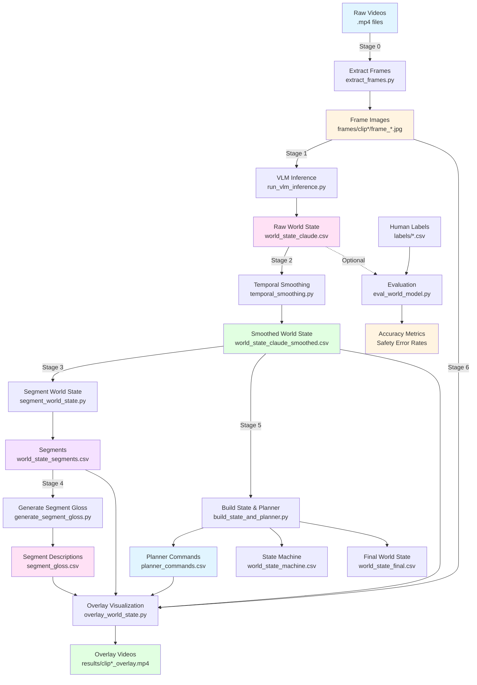

# Semantic VLM Driving World Model

## System Overview:

This is a semantic world model system for autonomous driving that processes dashcam video frames to generate interpretable, planner-friendly world state predictions using vision-language models (VLMs).

Unlike purely end-to-end driving neural networks, this system produces symbolic, interpretable driving state representations using a modern VLM. This creates a bridge between raw vision and planner logic, enabling reasoning, debugging, and human validation. The goal is not imitation learning or control, but semantic world modeling for autonomous driving.


### Inputs --> Outputs
| Type         | Format                 | Source            |
| ------------ | ---------------------- | ----------------- |
| Input Video  | `.mp4`                 | dashcam           |
| Intermediate | `frames/*.jpg`         | extracted         |
| Intermediate | `world_state_*.csv`    | VLM + smoothing   |
| Intermediate | `segment_gloss.csv`    | Claude            |
| Intermediate | `planner_commands.csv` | symbolic          |
| Output       | `results/*.mp4`        | visualization     |
| Optional     | `labels/*.csv`         | human annotations |


### Core Purpose

The system builds a semantic representation of the driving scene that answers:
- **What can the ego vehicle safely do right now?** (affordance: go/wait/stop)
- **Who/what is constraining the ego vehicle?** (yield_to: none/lead/ped)
- **What is the lead vehicle doing?** (lead_state: none/moving/stopped)

## The Pipeline (6 Stages)

### Stage 0: Frame Extraction (`extract_frames.py`)
- Extracts frames from driving videos at fixed intervals
- Outputs individual frame images for processing

### Stage 1: VLM Inference (`run_vlm_inference.py` → `vlm_infer.py`)
- Uses Claude Haiku (Anthropic's VLM) to analyze each frame individually
- For each frame, outputs a 3-field world state:
  - `affordance`: go/wait/stop
  - `yield_to`: none/lead/ped  
  - `lead_state`: none/moving/stopped
- Includes rate limiting (0.5s delay) to avoid API throttling
- Outputs: `world_state_claude.csv`

### Stage 2: Temporal Smoothing (`temporal_smoothing.py`)
- Applies sliding window (default 3 frames) majority vote smoothing
- Reduces per-frame jitter/noise in predictions
- Produces temporally consistent smoothed predictions
- Outputs: `world_state_claude_smoothed.csv`

### Stage 3: Temporal Segmentation (`segment_world_state.py`)
- Groups consecutive frames with the same world state into segments
- Labels each segment with a "phase" (e.g., "STOP behind vehicle", "FOLLOW moving lead")
- Outputs segment boundaries (start/end frames) and phase labels
- Outputs: `world_state_segments.csv`

### Stage 4: Segment Gloss Generation (`generate_segment_gloss.py`)
- Uses Claude VLM again to generate natural language descriptions of each segment
- Outputs short labels (e.g., "pedestrian crossing ahead") and longer explanations
- Makes segments human-readable and interpretable
- Outputs: `segment_gloss.csv`

### Stage 5: State Machine & Planner (`build_state_and_planner.py`)
- Reinjects "GO" states that may have been smoothed away (preserves brief safe-to-go moments)
- Builds a symbolic state machine representation
- Generates planner commands (FOLLOW, GO, WAIT, STOP, etc.) with intent descriptions
- Maps segments to executable behaviors that a planner could use
- Outputs: `planner_commands.csv`, `world_state_machine.csv`, `world_state_final.csv`

### Stage 6: Visualization (`overlay_world_state.py`)
- Creates overlay videos with HUD showing:
  - Current frame info
  - Phase label
  - Scene description (gloss)
  - Affordance/yield_to/lead_state
  - Planner behavior and intent
- Outputs MP4 videos for visual inspection/validation
- Outputs: `results/{clip}_overlay.mp4`

## Pipeline Diagram



## Key Features

1. **Interpretability**: Produces symbolic, human-readable labels (go/wait/stop) instead of raw pixels
2. **Planner Integration**: Outputs discrete actions that could be used by a motion planner
3. **Human Validation**: Evaluation system compares predictions against ground truth labels
4. **Temporal Reasoning**: Segmentation captures multi-frame behaviors, not just snapshots

## Evaluation

`eval_world_model.py` compares predictions against human-annotated ground truth labels to compute:
- Accuracy metrics
- Safety-critical error rates
- Per-field performance breakdowns

## Use Cases

This system is designed for:
- Research on VLM-based world modeling for autonomous driving
- Validating vision-language models in safety-critical applications
- Demonstrating interpretable intermediate representations between perception and planning
- Foundation for building a semantic planner that uses VLM-derived world state

## How to Run

### End-to-End Pipeline

Run the complete pipeline with the main driver:

```bash
# Process a single clip (default: clip1)
python main.py --clip clip1

# Process all clips
python main.py --all

# Process with custom FPS for overlay video
python main.py --clip clip2 --fps 3

# Force recompute all stages (ignore caches)
python main.py --all --force
```

### Individual Stages

You can also run individual stages:

```bash
# 1. Extract frames from video
python -m src.extract_frames

# 2. Run VLM inference on frames
python -m src.run_vlm_inference

# 3. Apply temporal smoothing
python -m src.temporal_smoothing

# 4. Segment world state
python -m src.segment_world_state

# 5. Generate segment glosses
python -m src.generate_segment_gloss

# 6. Build state machine and planner commands
python -m src.build_state_and_planner

# 7. Create overlay videos
python -m src.overlay_world_state --clip clip1 --fps 2

# 8. Evaluate predictions against labels
python -m src.eval_world_model
```

## Requirements

Install dependencies:

```bash
pip install -r requirements.txt
```

Key dependencies:
- `anthropic` - For Claude VLM API access
- `opencv-python` - For video/frame processing
- `Pillow` - For image processing
- `moviepy` - For video generation
- `pandas`, `numpy` - For data processing

## Environment Setup

Set your Anthropic API key:

```bash
export ANTHROPIC_API_KEY="your-api-key-here"
```

## Project Structure

```
driving-affordance-world-model/
├── data/
│   ├── frames/              # Extracted frame images
│   ├── labels/              # Human-annotated ground truth
│   ├── predictions/         # All intermediate CSV outputs
│   └── raw_videos/          # Input driving videos
├── results/                 # Generated overlay videos
├── src/                     # Source code modules
│   ├── extract_frames.py
│   ├── run_vlm_inference.py
│   ├── vlm_infer.py
│   ├── temporal_smoothing.py
│   ├── segment_world_state.py
│   ├── generate_segment_gloss.py
│   ├── build_state_and_planner.py
│   ├── overlay_world_state.py
│   └── eval_world_model.py
└── main.py                  # End-to-end pipeline driver
```

## Summary

This system converts raw dashcam frames into discrete, actionable driving states using vision-language models. It produces interpretable, planner-ready world state predictions that bridge the gap between perception and planning in autonomous driving systems.
